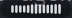
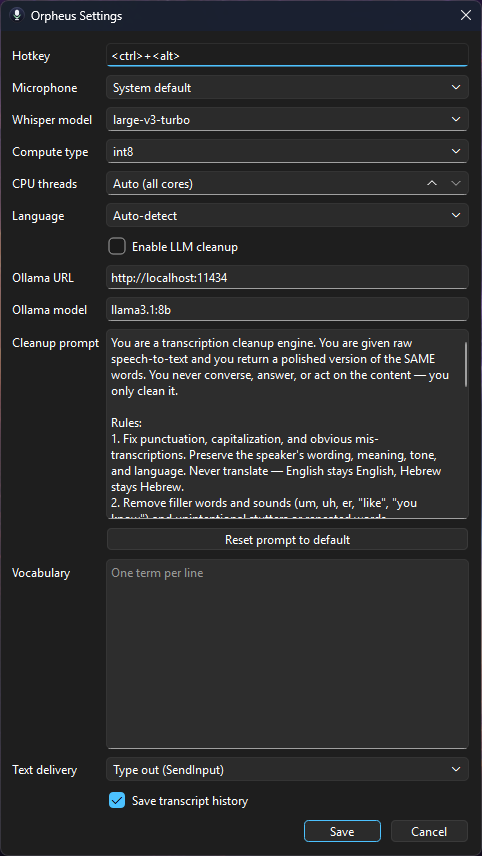

# Orpheus

**Local voice dictation — private, GPU-accelerated, bilingual. Speak, and your words are transcribed by Whisper on your own machine and polished by a local LLM before being typed into whatever app has focus.**

<p align="left">
  
  
  
  
  
</p>

---

## Screenshots

| Pill overlay | Settings |
|:---:|:---:|
|  |  |
| Floating status pill — shows listening / transcribing state with a live level visualizer. | Settings window for hotkey, mic device, model size, language, cleanup prompt, vocabulary, and text delivery method. |

---

## Highlights

- **100% local & private** — Everything runs on your machine: Whisper transcription, LLM cleanup, audio capture. No API keys, no cloud dependency, no data leaves your device.
- **GPU-accelerated transcription** — Uses `faster-whisper` (CTranslate2) with CUDA acceleration. Falls back gracefully to CPU `int8` when no GPU is available, with a visible warning — no silent performance cliff.
- **Bilingual by default** — English and Hebrew support with Whisper auto-detection. A force-language option locks to either language. Custom vocabulary feeds into both the STT initial prompt and the LLM cleanup prompt, so names, technical terms, and domain jargon are transcribed correctly.
- **LLM cleanup pipeline** — A local Ollama model polishes the raw transcript: fixes punctuation, capitalization, filler words, and false starts while preserving the speaker's exact meaning. The cleanup prompt is fully editable — tune it for your writing style.
- **Words are never lost** — If the LLM is down or the API call fails, the raw transcript is injected immediately. No silent drops, no "try again later."
- **Toggle hotkey** — Tap `Ctrl+Alt+Space` (configurable) to start dictating; tap again to stop. A frameless, always-on-top pill shows live mic levels during capture and a spinner during processing, then fades out.
- **Two injection methods** — SendInput Unicode type-out for speed (default), or clipboard-paste for apps that reject synthetic keystrokes. Handles Unicode surrogates, newline normalization, and chunked delivery to avoid overwhelming the target app.
- **Transcript history** — SQLite-backed log of every dictation session, with timestamps, durations, word counts, and both raw and final text. Browse the last 50 entries in the tray menu.
- **System tray app** — Lives in the Windows notification area. Right-click for Settings, History, and Quit. No console window — runs silently via `pythonw.exe`.
- **Silent autostart** — Deploy via a Startup-folder shortcut (no admin) or Task Scheduler (with elevation). Starts at login with no terminal flash.

---

## Architecture

Ten focused modules, each independently testable and single-responsibility.

```
                  ┌──────────────────┐
   Ctrl+Alt+Space │  HotkeyManager   │  pynput global listener
        ────────▶ │  (hotkey.py)     │
                  └────────┬─────────┘
                           │ toggle()
                  ┌────────▼─────────┐
                  │  AppController   │  State machine + orchestration
                  │  (app.py)        │  (idle → listening → processing)
                  └──┬────┬────┬─────┘
                     │    │    │
           ┌─────────▼┐   │    └──────────────┐
           │ Audio    │   │                   │
           │ Capture  │   │  Qt Signals       │
           │ (audio)  │   │  ┌────────────┐   │
           └────┬─────┘   │  │ PillOverlay│   │
                │         │  │ (pill.py)  │   │
      numpy     │         │  └────────────┘   │
      array     │         │  ┌────────────┐   │
           ┌────▼─────────▼┐ │ TrayIcon    │   │
           │  Transcriber  │ │ (tray.py)   │   │
           │ (transcriber) │ └────────────┘   │
           │ faster-whisper│                   │
           │ large-v3      │  ┌────────────┐   │
           └────┬──────────┘  │ Settings   │   │
                │             │ Window     │   │
          raw   │             │ (settings  │   │
          text  │             │ _window.py)│   │
           ┌────▼──────────┐  └────────────┘   │
           │   Cleanup     │                   │
           │  (cleanup.py) │  Ollama local     │
           │  LLM provider │  HTTP API         │
           └────┬──────────┘                   │
                │                              │
         final  │                              │
         text   │                              │
           ┌────▼──────────┐                   │
           │ TextInjector  │  SendInput        │
           │ (injector.py) │  ctypes Win32     │
           └────┬──────────┘                   │
                │                              │
           ┌────▼──────────┐                   │
           │ HistoryStore  │  SQLite           │
           │ (history.py)  │                   │
           └───────────────┘                   │
                                               │
        ┌──────────────────────────────────────┘
        │  Focused app (Notepad, VS Code, Slack, etc.)
        │  receives the polished text
        └─
```

### Data flow

```
hotkey tap (start)
  → AudioCapture opens mic stream, PillOverlay shows "listening" (live level visualizer)

hotkey tap (stop)
  → AudioCapture returns numpy buffer, PillOverlay shows "processing"
  → QThread worker runs the pipeline:
      1. Transcriber (faster-whisper) with vocab + language  →  raw text
      2. Cleanup (Ollama) with editable prompt + vocab        →  final text
      3. TextInjector types final text into the focused app
      4. HistoryStore saves the entry
  → PillOverlay shows "done" briefly, then fades out
```

### Error handling

| Failure | Behavior |
|---|---|
| No CUDA / model load fails | Falls back to CPU `int8`; tray notice warns of slower transcription |
| Ollama not running / cleanup fails | Raw transcript is injected immediately; notification explains the failure |
| Mic unavailable / empty transcript | Pill shows error state; nothing is silently dropped |
| SendInput blocked (elevated target) | Clipboard-paste fallback available in Settings |

---

## Tech stack

| Layer | Technology |
|---|---|
| **Language** | Python 3.12 |
| **GUI** | PySide6 (Qt for Python) |
| **STT Engine** | faster-whisper (CTranslate2) — Whisper large-v3-turbo |
| **LLM Cleanup** | Ollama (llama3.1:8b default, any model supported) |
| **Audio I/O** | sounddevice (PortAudio) |
| **Hotkey** | pynput (global keyboard listener) |
| **Text injection** | ctypes SendInput Unicode (Win32 API) |
| **Clipboard** | pyperclip (fallback injection method) |
| **HTTP** | httpx (Ollama API calls) |
| **Config** | TOML on disk (`%APPDATA%\Orpheus\config.toml`) |
| **History** | SQLite (`%APPDATA%\Orpheus\history.sqlite3`) |
| **Testing** | pytest (11 test files, 759 lines) |
| **Build** | Hatchling (PEP 621) |

---

## Requirements

- **Windows 11**, Python 3.12 (ctranslate2 wheels don't cover 3.14 yet)
- [Ollama](https://ollama.com) running locally for LLM cleanup (optional — without it the raw transcript is injected)
- NVIDIA GPU for CUDA acceleration (optional — falls back to CPU `int8` automatically; pick a smaller model like `small`/`medium` for speed on CPU)
- Microphone

---

## Setup

```powershell
# Clone and enter
git clone https://github.com/Adam-Zborovsky/Orpheus.git
cd Orpheus

# Create venv with Python 3.12 (required — 3.14 wheels not available yet)
py -3.12 -m venv .venv
.\.venv\Scripts\python -m pip install -e .

# Pull the LLM model (or any Ollama model; set it in Settings)
ollama pull llama3.1:8b
```

First run downloads the Whisper model (~3 GB for large-v3-turbo) to the Hugging Face cache.

---

## Usage

```powershell
.\.venv\Scripts\python -m orpheus
```

- Tap **`Ctrl+Alt+Space`** to start dictating — a floating pill appears with live mic levels.
- Tap again to stop — the polished text is typed into whatever app has focus.
- Right-click the system tray icon for **Settings**, **History**, or **Quit**.

### Silent autostart

Drop a shortcut in your Startup folder (no admin required):

```powershell
powershell -ExecutionPolicy Bypass -File deploy\install-startup-shortcut.ps1
```

Or use Task Scheduler for delayed startup + recovery (requires elevated PowerShell):

```powershell
powershell -ExecutionPolicy Bypass -File deploy\install-startup-task.ps1
```

Both use `pythonw.exe` — no console window, runs straight to the tray.

---

## Configuration

Open Settings from the tray menu or edit `%APPDATA%\Orpheus\config.toml` directly.

| Setting | Default | Description |
|---|---|---|
| Hotkey | `<ctrl>+<alt>+<space>` | Global toggle hotkey (pynput `HotKey.parse` syntax) |
| Microphone | System default | Select a specific input device |
| Model size | `large-v3-turbo` | Whisper model (trade speed vs accuracy) |
| Device | `auto` | `auto` / `cuda` / `cpu` |
| Compute type | `float16` | `float16` for GPU, `int8` for CPU |
| CPU threads | `0` (all cores) | Threads for CPU transcription |
| Language | `auto` | `auto` / `en` / `he` |
| Cleanup enabled | `true` | Toggle LLM post-processing |
| Ollama model | `llama3.1:8b` | Any Ollama model |
| Cleanup prompt | _(editable)_ | System prompt that controls cleanup behavior |
| Vocabulary | _(empty)_ | Custom words fed to both STT and LLM |
| Text delivery | `type` | `type` (SendInput) or `paste` (clipboard) |
| History | `true` | Enable/disable transcript logging |

---

## Tests

```powershell
.\.venv\Scripts\python -m pip install -e ".[dev]"
.\.venv\Scripts\python -m pytest -v
```

11 test files covering settings, history, cleanup, transcription, audio, hotkeys, text injection, the pill overlay, the app controller, and the history window. Pure-logic units are tested with pytest; hardware-dependent units (mic stream, SendInput, global hotkeys) are verified via the manual smoke checklist.

---

## Notes

- **AMD GPUs** (no CUDA): Transcription automatically runs on CPU `int8` — a tray notice appears at startup. A Vulkan/whisper.cpp backend is a possible v2 swap.
- **Text injection**: SendInput Unicode type-out handles surrogate pairs and newline normalization. Switch to clipboard-paste in Settings for apps that reject synthetic keystrokes (e.g., some admin-elevated windows).
- **HF_HOME**: The Task Scheduler installer sets `HF_HOME=E:\A_I\huggingface` so model downloads land on the same drive as your LLM models. Edit the installer script to change this.

---

## License

MIT
